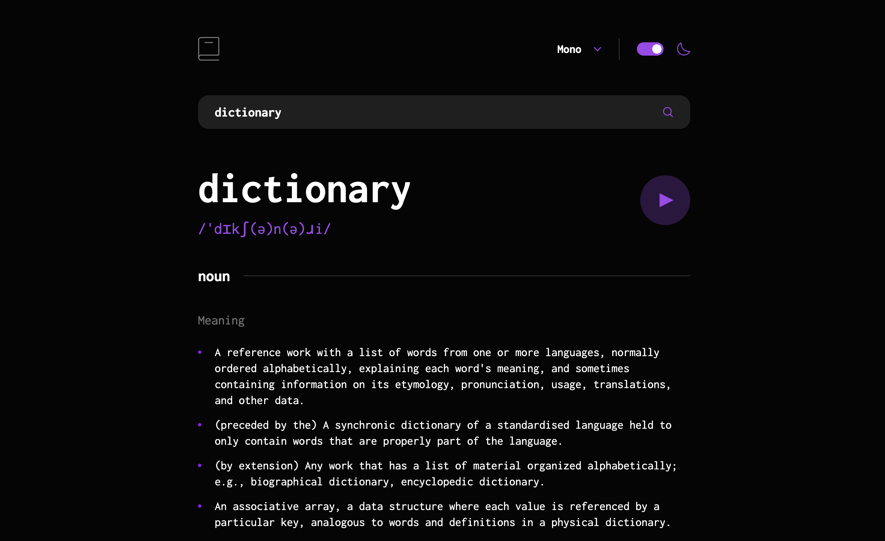

# Dictionary Web App

A fully responsive and interactive dictionary web application, designed to enhance word lookup experiences with modern UI/UX principles. Built using React, TypeScript, and Tailwind CSS, this project integrates the [Free Dictionary API](https://dictionaryapi.dev/) to deliver real-time word definitions, audio pronunciations, synonyms, antonyms, and usage examples. The user-friendly interface offers seamless interactions, dynamic theme switching, and customizable font options for a personalized browsing experience.

## Technologies used

* HTML5
* CSS3
* Tailwind CSS
* React
* TypeScript
* REST API
* Figma
* Git
* Vite

## Run Locally

Open your terminal and run the following command to clone the repository:

```bash
  git clone https://github.com/modeltoIT/dictionary-app.git
```

Go to the project directory

```bash
  cd dictionary-app
```

Install dependencies

```bash
  npm install
```

Start the server

```bash
  npm run dev
```

## Demo

[View the Project](https://modeltoit.github.io/dictionary-app/)

## Preview

